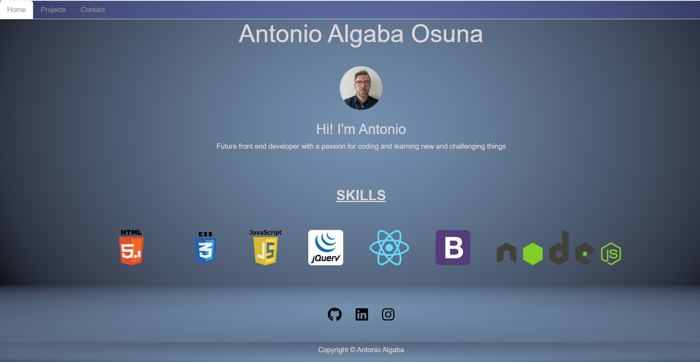

# React-Portfolio

## Description
Portfolio created with Rreact.

## Usage

Video: https://watch.screencastify.com/v/iZaS8ehCnckoMwm0nziH

Link to application: https://antonioalgaba.github.io/React-Portfolio/

App image:

 
## Technologies
  - React
  - React Router

## Base Requirements

* Your portfolio **must contain** the following information:
  * [ ] Your name
  * [ ] Links to your:
    * [ ] GitHub Profile
    * [ ] LinkedIn Page
    * [ ] Email Address
    * [ ] Phone Number - (optional)
    * [ ] PDF version of your resume
      * Your resume **must** contain up-to-date projects and professional experience
    * [ ] A list of projects (Challenges or Projects). For each project, make sure you have the following:
      * [ ] Project title
      * [ ] Link to the deployed version
      * [ ] Link to the GitHub repository
      * [ ] GIF or screenshot of the deployed application

### Required Components

* At a minium, your portfolio must render these 6 components:
  1. [ ] App
  2. [ ] Header
  4. [ ] Home
  5. [ ] Project Gallery
  6. [ ] Project
  7. [ ] Contact
  
##Credits

Skills Boot Camp in Front-End Web Development
